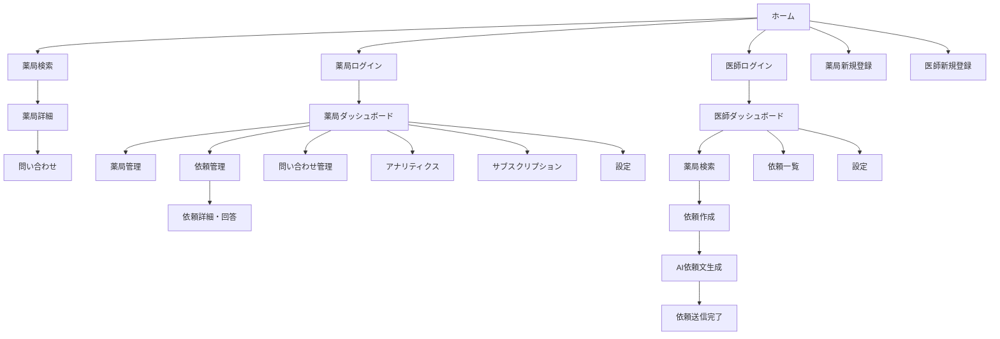

# HOME-DRUG CONNECT 機能仕様書

## 1. システム構成

### 1.1 画面構成
```
HOME-DRUG CONNECT
├── 公開ページ
│   ├── ホーム (/)
│   ├── 薬局検索 (/search)
│   ├── 薬局詳細 (/pharmacy/[id])
│   ├── ログイン (/login, /pharmacy/login, /doctor/login)
│   ├── 新規登録 (/pharmacy/register, /doctor/register)
│   └── その他 (利用規約、プライバシーポリシー等)
├── 薬局ダッシュボード (/dashboard)
│   ├── ダッシュボード
│   ├── 薬局管理
│   ├── 依頼管理
│   ├── 問い合わせ管理
│   ├── アナリティクス
│   ├── サブスクリプション
│   └── 設定
├── 医師ポータル (/doctor)
│   ├── ダッシュボード
│   ├── 薬局検索・依頼作成
│   ├── 依頼一覧
│   └── 設定
└── 管理者ダッシュボード (/admin)
    ├── ダッシュボード
    └── 薬局承認
```

### 1.2 ユーザーフロー

#### 薬局登録フロー
1. トップページ → 薬局新規登録
2. 基本情報入力（メール、パスワード、組織名、電話番号）
3. メール認証
4. 管理者承認待ち
5. 承認後、薬局プロフィール設定
6. サブスクリプション登録
7. サービス開始

#### 医師利用フロー
1. 医師新規登録（医師免許番号必須）
2. ログイン
3. 薬局検索
4. 患者情報入力
5. AI依頼文生成・確認
6. 依頼送信
7. 薬局からの回答確認

## 2. 画面仕様

### 2.1 ホームページ (/)

#### 概要
サービスの紹介と各ユーザー向けの導線を提供

#### 主要要素
- ヒーローセクション
  - キャッチコピー「在宅医療をもっとスムーズに」
  - 薬局検索ボタン
  - ログインボタン（薬局向け、医師向け）
- 特徴セクション（3つの主要機能）
- 利用方法セクション
- CTA（Call to Action）セクション

### 2.2 薬局検索ページ (/search)

#### 検索条件
- **位置情報検索**
  - 現在地から検索
  - 住所入力から検索
  - 検索範囲指定（3km、5km、10km、20km）
- **フィルター**
  - 満床の薬局を除外（デフォルト: ON）
  - 24時間対応
  - 無菌調剤室あり
  - 麻薬取扱い可能

#### 表示形式
- **地図ビュー**
  - Google Maps上にマーカー表示
  - マーカー色分け
    - 緑: 24時間対応
    - 黄: 空き多数（5名以上）
    - 赤: 通常
    - グレー: 満床
  - InfoWindowに基本情報表示
- **リストビュー**
  - カード形式で表示
  - 1ページ20件、ページネーション対応

#### 検索結果項目
- 薬局名
- 住所
- 距離
- 空き状況（○名受入可能）
- 対応可能サービスアイコン
- 「詳細を見る」ボタン
- 「依頼を作成」ボタン（医師のみ）

### 2.3 薬局詳細ページ (/pharmacy/[id])

#### 表示情報
- **基本情報**
  - 薬局名、住所、電話番号、メールアドレス
  - 営業時間（曜日別）
  - 定休日
- **サービス内容**
  - 24時間対応、休日対応、緊急時対応
  - 無菌調剤室、麻薬取扱い
  - その他特記事項
- **受け入れ状況**
  - 現在の受け入れ患者数
  - 最大受け入れ可能数
  - 空き状況ビジュアル表示（プログレスバー）
- **アクセス**
  - Google Maps埋め込み
  - 最寄り駅、バス停情報
- **問い合わせ**
  - 問い合わせフォーム（ログインユーザーのみ）

### 2.4 薬局ダッシュボード (/dashboard)

#### ダッシュボード画面
- **統計カード**
  - プロフィールビュー数（今月）
  - 問い合わせ数（今月）
  - コンバージョン率
  - 現在の患者数
- **グラフ**
  - 月別推移（ビュー数、問い合わせ数）
- **最近の活動**
  - 新着問い合わせ
  - 新着依頼
- **クイックアクション**
  - プロフィール編集
  - 受け入れ状況更新

#### 薬局管理 (/dashboard/pharmacies)
- 薬局一覧（複数店舗対応）
- 各薬局の編集・削除
- 新規薬局追加

#### 薬局編集 (/dashboard/pharmacy)
- **基本情報タブ**
  - 薬局名、住所、電話番号、メールアドレス
  - ウェブサイトURL
  - 説明文
- **営業時間タブ**
  - 曜日別営業時間設定
  - 定休日設定
- **サービスタブ**
  - 対応可能サービスのON/OFF
  - 特殊設備の有無
  - サービス提供範囲（km）
- **受け入れ管理タブ**
  - 最大受け入れ可能数
  - 現在の受け入れ数（自動計算）

#### 依頼管理 (/dashboard/requests)
- **依頼一覧**
  - ステータス別タブ（全て、回答待ち、承認済み、却下済み）
  - 依頼者情報、依頼日時、ステータス表示
  - 詳細表示ボタン
- **依頼詳細** (/dashboard/requests/[id])
  - 医師情報（名前、所属、連絡先）
  - 患者情報
    - 服用薬リスト
    - 既往歴・現疾患
    - 治療方針
    - 備考
  - AI生成依頼文
  - 回答フォーム
    - 承認/却下選択
    - 却下理由（選択式）
    - 備考欄

### 2.5 医師ポータル (/doctor)

#### ダッシュボード
- **統計情報**
  - 送信した依頼数
  - 承認された依頼数
  - 承認率
- **最近の依頼**
  - ステータス付きリスト表示

#### 依頼作成 (/doctor/request/new)
- **薬局選択**
  - 検索ページから遷移時は自動選択
  - 変更可能
- **患者情報入力**
  - 服用薬
    - 薬剤名（オートコンプリート）
    - 用量（ドロップダウン: 0.5錠〜10錠、0.5刻み）
    - 服用頻度
    - 追加/削除ボタン
  - 既往歴・現疾患（テキストエリア）
  - 今後の治療方針（テキストエリア）
  - 備考（テキストエリア）
- **AI依頼文生成**
  - 「依頼文を生成」ボタン
  - プレビューエリア
  - 編集可能
- **確認・送信**
  - 入力内容確認
  - 送信ボタン

#### 依頼一覧 (/doctor/requests)
- ステータス別フィルター
- 薬局名、患者情報概要、ステータス、日時表示
- 詳細表示リンク

### 2.6 管理者ダッシュボード (/admin)

#### ダッシュボード
- システム全体の統計
  - 総ユーザー数（薬局、医師別）
  - アクティブユーザー数
  - 総依頼数
  - 成約率

#### 薬局承認 (/admin/pharmacies)
- 承認待ち薬局一覧
- 薬局詳細確認
- 承認/却下ボタン
- 却下理由入力

## 3. API仕様

### 3.1 認証関連

#### POST /api/auth/login
ログイン処理

**リクエスト**
```json
{
  "email": "user@example.com",
  "password": "password123"
}
```

**レスポンス**
```json
{
  "user": {
    "id": "uuid",
    "email": "user@example.com",
    "role": "pharmacy_admin"
  },
  "session": {
    "access_token": "jwt_token",
    "refresh_token": "refresh_token"
  }
}
```

### 3.2 薬局検索

#### GET /api/pharmacies/search
位置情報ベースの薬局検索

**パラメータ**
- `lat`: 緯度
- `lng`: 経度
- `radius`: 検索範囲（km）
- `excludeFull`: 満床除外（boolean）
- `services[]`: 必要なサービス（配列）

**レスポンス**
```json
{
  "pharmacies": [
    {
      "id": "uuid",
      "name": "○○薬局",
      "address": "東京都...",
      "distance_km": "2.5",
      "lat": 35.6812,
      "lng": 139.7671,
      "available_spots": 3,
      "twenty_four_support": true,
      "has_clean_room": false,
      "handles_narcotics": true
    }
  ]
}
```

### 3.3 依頼管理

#### POST /api/requests
新規依頼作成

**リクエスト**
```json
{
  "pharmacy_id": "uuid",
  "patient_info": {
    "medications": [
      {
        "name": "アムロジピン錠5mg",
        "dosage": "1錠",
        "frequency": "1日1回朝食後"
      }
    ],
    "conditions": ["高血圧症", "糖尿病"],
    "treatment_plan": "血圧管理を継続...",
    "notes": "特記事項"
  },
  "ai_document": "AI生成された依頼文"
}
```

#### POST /api/responses
薬局からの回答

**リクエスト**
```json
{
  "request_id": "uuid",
  "accepted": false,
  "rejection_reasons": {
    "capacity": true,
    "inventory": false,
    "out_of_scope": false,
    "other": "詳細理由"
  },
  "notes": "申し訳ございません..."
}
```

### 3.4 AI機能

#### POST /api/ai/generate-request
依頼文生成

**リクエスト**
```json
{
  "pharmacyName": "○○薬局",
  "doctorInfo": {
    "name": "田中太郎",
    "organization": "田中クリニック"
  },
  "patientInfo": {
    "medications": [...],
    "conditions": [...],
    "treatmentPlan": "...",
    "notes": "..."
  }
}
```

**レスポンス**
```json
{
  "document": "○○薬局 御中\n\n平素より大変お世話になっております..."
}
```

## 4. データベース設計

### 4.1 主要テーブル

#### users
| カラム名 | 型 | 説明 |
|----------|-----|------|
| id | UUID | 主キー |
| email | VARCHAR | メールアドレス |
| role | ENUM | ユーザーロール |
| name | VARCHAR | 氏名 |
| clinic_name | VARCHAR | クリニック名（医師） |
| medical_license_number | VARCHAR | 医師免許番号 |
| organization_name | VARCHAR | 組織名 |
| phone | VARCHAR | 電話番号 |
| company_id | UUID | 所属会社ID |

#### pharmacies
| カラム名 | 型 | 説明 |
|----------|-----|------|
| id | UUID | 主キー |
| user_id | UUID | ユーザーID |
| name | VARCHAR | 薬局名 |
| address | VARCHAR | 住所 |
| location | GEOGRAPHY | 位置情報 |
| phone | VARCHAR | 電話番号 |
| email | VARCHAR | メールアドレス |
| twenty_four_support | BOOLEAN | 24時間対応 |
| holiday_support | BOOLEAN | 休日対応 |
| emergency_support | BOOLEAN | 緊急対応 |
| max_capacity | INTEGER | 最大受入数 |
| current_capacity | INTEGER | 現在受入数 |
| accepted_patients_count | INTEGER | 承認患者数 |
| status | ENUM | ステータス |
| business_hours | JSONB | 営業時間 |

#### requests
| カラム名 | 型 | 説明 |
|----------|-----|------|
| id | UUID | 主キー |
| pharmacy_id | UUID | 薬局ID |
| doctor_id | UUID | 医師ID |
| patient_info | JSONB | 患者情報 |
| ai_document | TEXT | AI生成文書 |
| status | ENUM | ステータス |
| expires_at | TIMESTAMP | 有効期限 |

#### responses
| カラム名 | 型 | 説明 |
|----------|-----|------|
| id | UUID | 主キー |
| request_id | UUID | 依頼ID |
| pharmacy_id | UUID | 薬局ID |
| accepted | BOOLEAN | 承認/却下 |
| rejection_reasons | JSONB | 却下理由 |
| notes | TEXT | 備考 |
| responded_at | TIMESTAMP | 回答日時 |

## 5. 画面遷移図



## 6. エラー処理

### 6.1 バリデーションエラー
- フォーム入力値の検証
- リアルタイムエラー表示
- エラーメッセージの日本語化

### 6.2 システムエラー
- 500エラー: 「システムエラーが発生しました」
- 404エラー: カスタム404ページ
- 認証エラー: ログインページへリダイレクト

### 6.3 業務エラー
- 薬局満床時: 「現在満床のため受け入れできません」
- 依頼期限切れ: 「この依頼は期限切れです」
- 重複回答: 「既に回答済みです」

