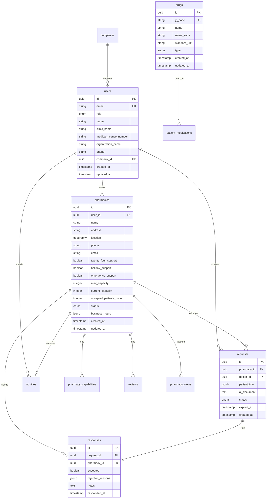

# HOME-DRUG CONNECT 技術仕様書

## 1. システムアーキテクチャ

### 1.1 全体構成
```
┌─────────────────┐     ┌─────────────────┐     ┌─────────────────┐
│   クライアント    │     │    Vercel       │     │   Supabase      │
│  (Browser/PWA)  │────▶│  (Next.js App)  │────▶│  (PostgreSQL)   │
└─────────────────┘     └─────────────────┘     └─────────────────┘
         │                       │                        │
         │                       ▼                        │
         │              ┌─────────────────┐               │
         │              │ External APIs   │               │
         │              ├─────────────────┤               │
         │              │ • Google Maps   │               │
         │              │ • OpenAI        │               │
         │              │ • Stripe        │               │
         └─────────────▶│ • Resend        │◀─────────────┘
                        └─────────────────┘
```

### 1.2 技術スタック

#### フロントエンド
- **フレームワーク**: Next.js 15.4.5 (App Router)
- **UI ライブラリ**: React 19.1.0
- **スタイリング**: Tailwind CSS 4.x
- **状態管理**: Zustand 5.0.7 + React Context API
- **フォーム**: React Hook Form (ネイティブフォーム)
- **アニメーション**: Framer Motion 12.x
- **型定義**: TypeScript 5.x (strict mode)

#### バックエンド
- **ランタイム**: Node.js (Vercel Edge Runtime)
- **API**: Next.js API Routes (App Router)
- **認証**: Supabase Auth (JWT)
- **データベース**: Supabase (PostgreSQL 15)
- **リアルタイム**: Supabase Realtime

#### インフラ
- **ホスティング**: Vercel
- **CDN**: Vercel Edge Network
- **データベース**: Supabase Cloud
- **ファイルストレージ**: Supabase Storage

## 2. ディレクトリ構造

```
home-drug-connect/
├── app/                          # Next.js App Router
│   ├── (public)/                # 公開ルートグループ
│   ├── admin/                   # 管理者機能
│   ├── api/                     # API エンドポイント
│   ├── auth/                    # 認証関連ページ
│   ├── dashboard/               # 薬局ダッシュボード
│   ├── doctor/                  # 医師ポータル
│   ├── pharmacy/                # 薬局個別ページ
│   ├── search/                  # 検索機能
│   ├── globals.css             # グローバルスタイル
│   ├── layout.tsx              # ルートレイアウト
│   └── page.tsx                # ホームページ
├── components/                  # 再利用可能コンポーネント
│   ├── auth/                   # 認証関連
│   ├── dashboard/              # ダッシュボード関連
│   ├── doctor/                 # 医師向け
│   ├── forms/                  # フォーム部品
│   ├── layout/                 # レイアウト部品
│   ├── maps/                   # 地図関連
│   ├── pharmacy/               # 薬局関連
│   ├── search/                 # 検索関連
│   └── ui/                     # 汎用UIコンポーネント
├── lib/                        # ユーティリティ
│   ├── auth/                   # 認証ユーティリティ
│   ├── email/                  # メールテンプレート
│   ├── google-maps/            # Google Maps連携
│   ├── hooks/                  # カスタムフック
│   ├── supabase/               # Supabaseクライアント
│   └── utils/                  # 汎用ユーティリティ
├── types/                      # 型定義
│   ├── database.ts            # データベース型
│   └── supabase.ts            # Supabase生成型
├── public/                     # 静的ファイル
├── scripts/                    # ビルド・管理スクリプト
└── supabase/                   # データベース設定
    └── migrations/             # マイグレーション
```

## 3. データベース設計

### 3.1 ER図


### 3.2 インデックス設計
```sql
-- 位置情報検索用
CREATE INDEX idx_pharmacies_location ON pharmacies USING GIST (location);
CREATE INDEX idx_pharmacies_status ON pharmacies (status);

-- 薬剤検索用
CREATE EXTENSION IF NOT EXISTS pg_trgm;
CREATE INDEX idx_drugs_name_trgm ON drugs USING gin (name gin_trgm_ops);
CREATE INDEX idx_drugs_name_kana_trgm ON drugs USING gin (name_kana gin_trgm_ops);

-- 依頼管理用
CREATE INDEX idx_requests_pharmacy_id ON requests (pharmacy_id);
CREATE INDEX idx_requests_doctor_id ON requests (doctor_id);
CREATE INDEX idx_requests_status ON requests (status);
CREATE INDEX idx_requests_expires_at ON requests (expires_at);

-- パフォーマンス最適化
CREATE INDEX idx_responses_request_id ON responses (request_id);
CREATE INDEX idx_inquiries_pharmacy_id ON inquiries (pharmacy_id);
CREATE INDEX idx_reviews_pharmacy_id ON reviews (pharmacy_id);
```

### 3.3 Row Level Security (RLS)
```sql
-- users テーブル
CREATE POLICY "Users can view own profile" ON users
  FOR SELECT USING (auth.uid() = id);

CREATE POLICY "Users can update own profile" ON users
  FOR UPDATE USING (auth.uid() = id);

-- pharmacies テーブル
CREATE POLICY "Public can view active pharmacies" ON pharmacies
  FOR SELECT USING (status = 'active');

CREATE POLICY "Pharmacy owners can update" ON pharmacies
  FOR UPDATE USING (auth.uid() = user_id);

-- requests テーブル
CREATE POLICY "Doctors can create requests" ON requests
  FOR INSERT WITH CHECK (auth.uid() = doctor_id);

CREATE POLICY "Related users can view requests" ON requests
  FOR SELECT USING (
    auth.uid() = doctor_id OR 
    auth.uid() IN (SELECT user_id FROM pharmacies WHERE id = pharmacy_id)
  );
```

## 4. API設計

### 4.1 RESTful API エンドポイント

#### 認証系
```
POST   /api/auth/login          # ログイン
POST   /api/auth/logout         # ログアウト
POST   /api/auth/refresh        # トークンリフレッシュ
POST   /api/auth/reset-password # パスワードリセット
```

#### 薬局系
```
GET    /api/pharmacies/search   # 薬局検索
GET    /api/pharmacies/:id      # 薬局詳細
PUT    /api/pharmacies/:id      # 薬局更新
DELETE /api/pharmacies/:id      # 薬局削除
```

#### 依頼系
```
GET    /api/requests            # 依頼一覧
POST   /api/requests            # 依頼作成
GET    /api/requests/:id        # 依頼詳細
PUT    /api/requests/:id        # 依頼更新
```

#### 回答系
```
POST   /api/responses           # 回答作成
GET    /api/responses/:id       # 回答詳細
```

#### AI系
```
POST   /api/ai/generate-request # 依頼文生成
```

### 4.2 API レスポンス形式

#### 成功レスポンス
```typescript
interface SuccessResponse<T> {
  success: true;
  data: T;
  metadata?: {
    page?: number;
    perPage?: number;
    total?: number;
  };
}
```

#### エラーレスポンス
```typescript
interface ErrorResponse {
  success: false;
  error: {
    code: string;
    message: string;
    details?: any;
  };
}
```

### 4.3 認証フロー
```
1. ユーザーがメール/パスワードでログイン
2. Supabase Authが JWT トークンを発行
3. クライアントがトークンを保存（httpOnly Cookie）
4. APIリクエスト時にトークンを自動送信
5. サーバーサイドでトークンを検証
6. RLSによりデータアクセスを制御
```

## 5. セキュリティ仕様

### 5.1 認証・認可
- **認証方式**: JWT (Supabase Auth)
- **トークン保存**: httpOnly Cookie
- **セッション管理**: リフレッシュトークン方式
- **権限管理**: Role-Based Access Control (RBAC)

### 5.2 データ保護
- **通信**: HTTPS強制
- **パスワード**: bcrypt ハッシュ化
- **環境変数**: `.env.local` で管理
- **APIキー**: サーバーサイドのみで使用

### 5.3 脆弱性対策
- **SQLインジェクション**: Prepared Statement使用
- **XSS**: React自動エスケープ + CSP設定
- **CSRF**: SameSite Cookie + トークン検証
- **レート制限**: Vercel Edge Middleware

### 5.4 コンテンツセキュリティポリシー
```typescript
const cspHeader = `
  default-src 'self';
  script-src 'self' 'unsafe-eval' 'unsafe-inline' https://*.google.com https://*.googleapis.com;
  style-src 'self' 'unsafe-inline' https://*.googleapis.com;
  img-src 'self' blob: data: https://*.google.com https://*.googleapis.com;
  font-src 'self' https://*.gstatic.com;
  connect-src 'self' https://*.supabase.co https://*.google.com https://api.openai.com;
  frame-src 'self' https://*.google.com https://js.stripe.com;
`;
```

## 6. パフォーマンス最適化

### 6.1 フロントエンド最適化
- **コード分割**: 動的インポート使用
- **画像最適化**: Next.js Image Component
- **フォント最適化**: next/font 使用
- **バンドルサイズ**: Tree Shaking有効
- **キャッシュ**: ブラウザキャッシュ + SWR

### 6.2 バックエンド最適化
- **Edge Functions**: Vercel Edge Runtime
- **データベースクエリ**: インデックス最適化
- **N+1問題**: Eager Loading使用
- **キャッシュ**: Redis (将来実装)

### 6.3 SEO最適化
- **メタデータ**: 動的生成
- **サイトマップ**: 自動生成
- **robots.txt**: クローリング制御
- **構造化データ**: JSON-LD実装

## 7. 開発環境

### 7.1 必要なツール
- Node.js 18.x以上
- npm 9.x以上
- Git
- VS Code (推奨)

### 7.2 環境変数
```bash
# Supabase
NEXT_PUBLIC_SUPABASE_URL=
NEXT_PUBLIC_SUPABASE_ANON_KEY=
SUPABASE_SERVICE_ROLE_KEY=

# Google Maps
NEXT_PUBLIC_GOOGLE_MAPS_API_KEY=

# Stripe
STRIPE_SECRET_KEY=
NEXT_PUBLIC_STRIPE_PUBLISHABLE_KEY=
STRIPE_WEBHOOK_SECRET=
STRIPE_SUBSCRIPTION_PRICE_ID=

# OpenAI
OPENAI_API_KEY=

# Resend
RESEND_API_KEY=

# Application
NEXT_PUBLIC_APP_URL=
EMAIL_FROM=
```

### 7.3 開発コマンド
```bash
# 開発サーバー起動
npm run dev

# ビルド
npm run build

# 本番サーバー起動
npm run start

# リント
npm run lint

# 型チェック
npm run type-check

# データベースマイグレーション
npm run db:migrate

# 薬剤データインポート
npm run etl:drugs
```

## 8. デプロイメント

### 8.1 CI/CD パイプライン
```yaml
# GitHub Actions
on:
  push:
    branches: [main]
  pull_request:
    branches: [main]

jobs:
  test:
    - npm install
    - npm run lint
    - npm run type-check
    - npm run test
  
  deploy:
    - vercel --prod
```

### 8.2 環境構成
- **開発環境**: ローカル + Supabase Local
- **ステージング環境**: Vercel Preview
- **本番環境**: Vercel Production

### 8.3 監視・ログ
- **アプリケーション監視**: Vercel Analytics
- **エラー監視**: Sentry (将来実装)
- **ログ管理**: Vercel Logs
- **アップタイム監視**: Better Uptime (将来実装)

## 9. テスト戦略

### 9.1 テストの種類
- **単体テスト**: Jest + React Testing Library
- **統合テスト**: Playwright
- **E2Eテスト**: Cypress
- **パフォーマンステスト**: Lighthouse CI

### 9.2 テストカバレッジ目標
- ユニットテスト: 80%以上
- 統合テスト: 主要フロー100%
- E2Eテスト: クリティカルパス100%

## 10. 今後の拡張計画

### 10.1 機能拡張
- 在庫管理システム連携
- リアルタイムチャット機能
- 多言語対応（英語、中国語）
- モバイルアプリ開発

### 10.2 技術的改善
- マイクロサービス化
- GraphQL API導入
- Redis キャッシュ層
- Kubernetes移行
